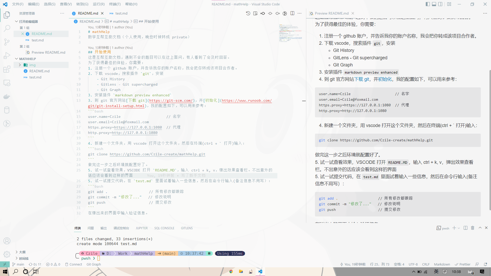

# mathHelp
数学互帮互助文档（个人使用，晚些时候转成 private）

## 开始使用
这是互帮互助文档，遇到不会的题目可以在这上面问，有人看到了会及时回答。
为了获得最佳的体验，你需要：
1. 注册一个 github 账户，并告诉我你的账户名称，我会把你转成该项目合作者。
2. 下载 vscode，搜索插件 `git`，安装
    - Git History
    - GitLens - Git supercharged
    - Git Graph
3. 安装插件 `markdown preview enhanced`
3. 到 git 官方网站[下载 git](https://git-scm.com/)，并[初始化](https://www.runoob.com/git/git-install-setup.html)，我的配置如下，可以用来参考：
```bash
user.name=Czile                     // 名字
user.email=Czile@foxmail.com
https.proxy=https://127.0.0.1:1080  // 代理
http.proxy=http://127.0.0.1:1080
```
4. 新建一个文件夹，用 vscode 打开这个文件夹，然后在终端(ctrl + ` 打开)输入：
```bash
git clone https://github.com/Czile-create/mathHelp.git
```
做完这一步之后环境就配置好了。

5. 试一试查看效果，VSCODE 打开 `README.MD`，输入 ctrl + k, v，弹出效果查看栏。不出意外的话应该会看到这样的界面

5. 试一试提交代码，在 `test.md` 里面试着输入一些信息，然后在命令行输入(备注信息不用写）：
```bash
git add .                   // 所有修改都跟踪
git commit -m "修改了..."   // 修改说明
git push                    // 提交修改
```
在弹出来的界面中输入验证信息。
